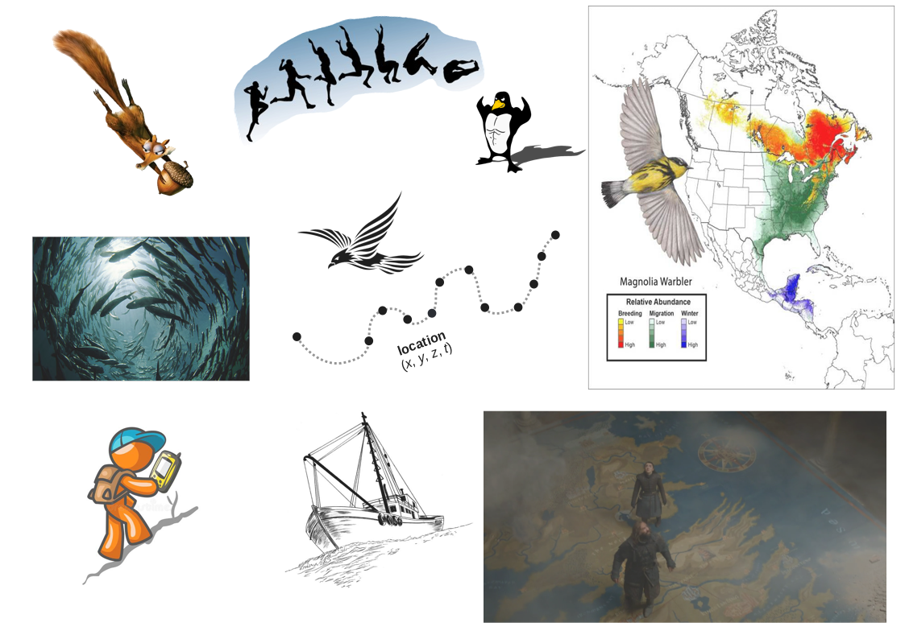
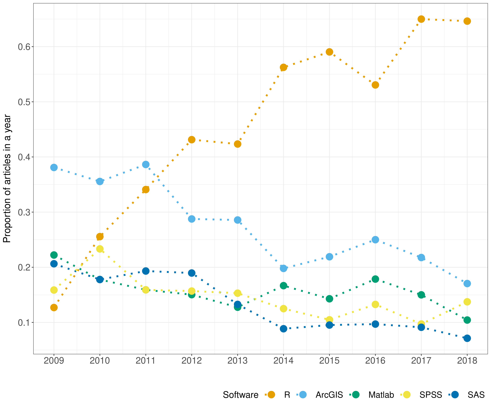
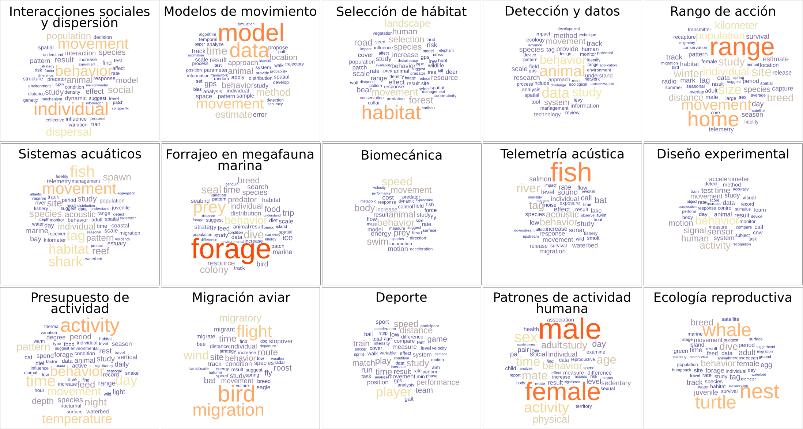

# Ecología del movimiento

```{r, echo=FALSE, warning=FALSE,message=FALSE,fig.show="hold",out.width="70%", fig.align = "center", fig.alt= "La imagen está compuesta por una decena de imágenes más pequeñas que representan movimiento de diferentes formas: arriba a la izquierda, una ardilla cayendo hacia abajo y sosteniendo una castaña. A su derecha, imágenes consecutivas tipo frame-by-frame del proceso de hacer un salto largo por parte de una persona. A su lado, un pingüino musculoso. Más a la derecha, un mapa de Norteamérica y Centroamérica mostrando zonas de hábitat del Magolia Warbler, con un dibujo del ave. En tonalidades de rojo, hay mayor abundancia del ave en fase reproductiva en el este de Canadá, mientras en verde se muestra que en etapa de migración se encuentra más en la mitad este de los Estados Unidos. Durante el invierno, en azul se muestra una mayor presencia del ave en la península de Yucatán, Belize, Honduras y Nicaragua. Debajo de estas imágenes, hay una foto del interior de un banco de peces. A la derecha de la imagen, una representación de una trayectoria, con puntos simbolizando localizaciones en el espacio unidos por una línea punteada conectando el tiempo. Sobre esta trayectoria, una representación estilizada de un ave. Más abajo, una persona caminando en pendiente hacia arriba con un gps. A su derecha, el dibujo de un barco en movimiento. Finalmente, a la derecha de este, una imagen de Juego de Tronos. Arya y Sandor Clegane están caminando sobre un mapa de Westeros."}

```

---

class: chapter-slide

# ¿Cómo revisar un campo de la ciencia con la minería de texto?


---

## 1. Preguntas

--
  * ¿Temas abordados?

  * ¿Software usados?
  
--

## 2. Colección de datos

--

  * Definir qué documentos analizar:
  
  Artículos científicos con peer-review en **inglés** sobre el movimiento voluntario de animales y humanos publicados **entre 2009 y 2018**. [Diagrama de flujo](https://rociojoo.github.io/mov-eco-review/data-collection-and-processing.html).
  
  * Resúmenes, títulos, palabras clave y métodos. 
  
---

## 3. Procesamiento de datos

 * Resultados de búsqueda en formato estándar. [refsplitr](https://github.com/ropensci/refsplitr)
 
 * Extraer métodos de los documentos. [fulltext](https://docs.ropensci.org/fulltext/), [xlm2](https://cran.r-project.org/web/packages/xml2/index.html), [tm](https://cran.r-project.org/web/packages/tm/)

 * Remover palabras no informativas, estandarizar el inglés, lematizar. [tidytext](https://cran.r-project.org/web/packages/tidytext/index.html), [stringr](https://cran.r-project.org/web/packages/stringr/index.html), [textstem](https://cran.r-project.org/web/packages/textstem/index.html)


--


## 4. Análisis de datos

  * Software: Diccionario
  
  * Temas: Asignación Latente de Dirichlet
 
---

## Análisis de datos: Diccionario

  * Compuesto de conceptos y términos asociados

    * Ejm. Concepto: R. Términos: R Software, R package, etc.
    
    * Uso de [expresiones regulares](https://github.com/rladieschile/taller-regex-2021). 

--

  * Lista de 33 software y términos asociados
  
--

  * ¿Dónde? Título, palabras clave, resumen, **métodos**

--

  * Validación sobre muestra aleatoria de documentos (Accuracy: 0.88)


---

## Análisis de datos: Diccionario

```{r, echo=FALSE, warning=FALSE,message=FALSE,fig.show="hold",out.width="60%", fig.align = "center", fig.alt= "Gráfica de puntos y líneas sobre uso de software para los cinco software más usados. En el eje x, años desde el 2009 al 2018. En el eje y, la proporción de artículos en el año mencionando al software. En el gráfico, los puntos están unidos por líneas punteadas para cada software, que está cada uno de un color distinto. R, en naranja, empieza sobre 0.1 y creciendo hasta llegar a más de 0.6 en 2017 y 2018. Los otros cuatro software —ArcGIS, SPSS, Matlab, SAS, SPSS, en ese orden— empezaron con una proporción de uso mayor pero las líneas reflejan tendencias decrecientes."}

```

---

# Análisis de datos: Temas

Ejemplo: ¿Por qué asistir a LatinR?

.pull-left[

Respuestas (documentos)

 * *Ser <span style="color:#B14380">parte</span> de un <span style="color:#B14380">colectivo</span>*
 

 * *Poder <span style="color:#00805E">aprender</span> <span style="color:#B14380">juntes</span> sobre <span style="color:#0025B2">R</span>*
 
 * *Hay <span style="color:#00805E">talleres</span> para <span style="color:#0025B2">programar</span> mejor*
 
]

--

.pull-right[

Temas subyacentes

<span style="color:#B14380">Comunidad</span>

<span style="color:#00805E">Conocimiento</span>

<span style="color:#0025B2">R</span>]


---

# Análisis de datos: Temas

Modelos de Asignación Latente de Dirichlet:

  * Tres niveles: documento, palabras, temas (número fijo)

--

  * Documento compuesto por palabras

--

  * Cada palabra está asociada con más o menos fuerza (probabilidad) a algún tema

--

  * Elección de palabras al redactar documento refleja los temas subyacentes.

--

(Para descripción del modelo estadístico, ver [presentación](https://youtu.be/6BKhkH-ZVA0))


---

# Análisis de datos: Temas

```{r, echo=FALSE, warning=FALSE,message=FALSE,fig.show="hold",out.width="80%", fig.align = "center", fig.alt= "Nubes de palabras de los 15 temas identificados. En cada nube, el tamaño de las palabras es proporcional a la probabilidad condicional de la palabra al tema. Son 15 nubes en 3 filas de 5 columnas. Primera fila: 1. Tema interacciones sociales y dispersión; las palabras más grandes son individual, movement, behavior, dispersal, population, social. 2. Tema modelos de movimiento; las palabras más grandes son model (muy grande), data, movement, method, estimate, time. 3. Tema selección de hábitat; las palabras más grandes son habitat (muy grande), landscape, movement, selection, road, forest. 4. Tema detección y datos; las palabras más grandes son animal, data, behavior, movement, system. 5. Tema rango de acción; las palabras más importantes son range (muy grande), home, movement, size, individual, population, kilometer. Segunda fila: 1. Tema sistemas acuáticos; las palabras más grandes son movement, fish, habitat, shark, tag. 2. Tema forrajeo en megafauna marina; las palabras más grandes son forage (muy grande), prey, behavior, seal, dive, colony. 3. Tema biomecánica; las palabras más grandes son speed, behavior, body, movement, swim, animal. 4. Tema telemetría acústica; las palabras más grandes son fish (muy grande), river, behavior, tag, acoustic. 5. Tema diseño experimental; las palabras más grandes son behavior, activity, human, signal, sensor, test, motion. Tercera fila: 1. Tema presupuesto de actividad; las palabras más grandes son activity (muy grande), behavior, time, temperature, day, movement, pattern. 2. Tema migración aviar; las palabras más grandes son bird, migration, flight, luego wind, migratory. 3. Tema deporte; las palabras más grandes son: player, speed, distance, study, speed, performance. 4. Tema patrones de actividad humana; las palabras más grandes son male, female (ambos muy grandes), sex, activity, age, physical, behavior, mate. 5. Tema ecología reproductiva; las palabras más grandes son nest, whale, turtle, luego dive, breed, behavior."}

```

[topicmodels](https://cran.r-project.org/web/packages/topicmodels/index.html), 
[ggwordcloud](https://cran.r-project.org/web/packages/ggwordcloud/index.html)

---

# Análisis de datos: Temas

  * Validación de temas: palabra intrusiva
  
    * Tomar las palabras con mayor probabilidad respecto a un tema
    
    * Tomar una palabra de alta probabilidad de otro tema y añadirla
    
    * Pedir a personas que identifiquen la palabra que no pertenece
    

---

# Sesgos

  * Supuesto de que no hay cambios en el tiempo
  
  * Idioma
  
---

<br>

<br>

.center[Gracias]

```{r, echo=FALSE, warning=FALSE,message=FALSE,fig.show="hold",out.width="10%", fig.align = "center", fig.alt= "Logo de HFSP: Human Frontiers Science Program"}
knitr::include_graphics("./img/hfsp.jpeg")
```


`r  icons::fontawesome$brands$"twitter-square"`  @rocio_joo

`r  icons::fontawesome("envelope")`  rocio.joo@globalfishingwatch.org

https://rociojoo.netlify.app/


